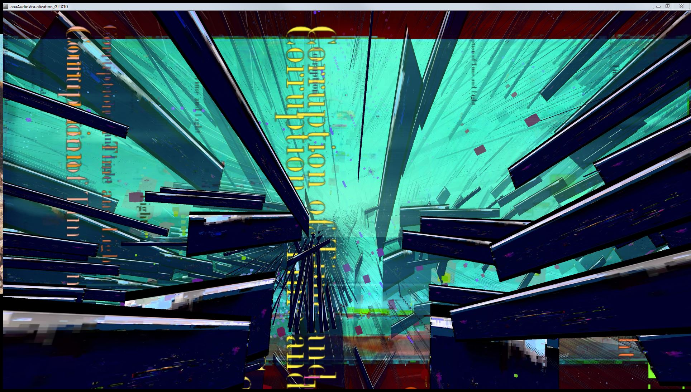

# The Introductory Projects:
These are a collection of the projects that got me into programming in the first place. They were all written between 2012 and 2014, while I was getting my Bachelors of Fine Arts in digital electronic art and film editing at California College of the Arts.

These projects bridged the gap between experimental film making and programming. Once I discovered that programming can be a creative medium, I began experimenting with that medium. I was able to gain a foothold because Processing is such a simplified programming language.

Most are written with [Processing](https://processing.org/), or for an [Arduino](https://www.arduino.cc/) or a combination of both.

## SoundChess1:

This program was never completed because of my lack of skills, time, and the complicated rules of chess. It was designed to generate a layered sound track as the game was played. Each piece moved would influence the way the sound was composed and arranged, generating a dynamic musical piece that was unique to each game played. Unfortunately, this feature was way beyond the scope of the class, and I ended up spending most of the time just getting the chess program itself to work.

I hope to salvage the design of the pieces some day, and the idea. The logic, however probably won't make it.

## Glix10:

This is the piece that really kicked it off for me. The image above is a screenshot from the live video. 
